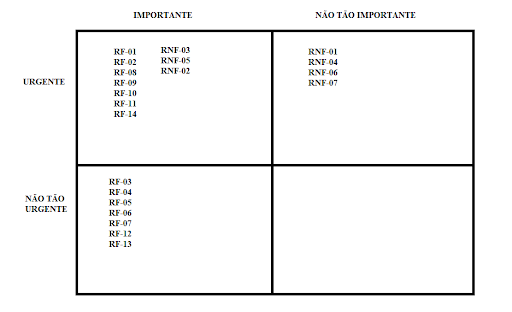

# Especificações do Projeto

A escolha do referido problema foi definida por meio de discussões e estudos realizados pelos membros da equipe. Os detalhes levantados nesse processo foram consolidados na forma de personas e histórias de usuários.

## Personas

## Histórias de Usuários

Com base na análise das personas forma identificadas as seguintes histórias de usuários:

|EU COMO... `PERSONA`| QUERO/PRECISO ... `FUNCIONALIDADE` |PARA ... `MOTIVO/VALOR`                 |
|--------------------|------------------------------------|----------------------------------------|
|Pedro  | Ter acesso a uma aplicação que permita com que eu registre meus treinos e dietas           | Poder conseguir ser mais disciplinado               |
|Julia       | Ter acesso a um calendário onde eu possa acompanhar o meu progresso na academia                 | Melhorar o meu desempenho na academia |
|Marcos       | Registrar minha dieta semanal que foi passada pela nutricionista                 |Para que eu possa ter os macronutrientes calculados de forma prática |
|Ana       | Preciso marcar com facilidade se conclui o treino do dia                 | Para poder registrar o meu progresso |
|Rafael       | Preciso de uma aplicação onde eu possa registrar o treino passado pela personal                 | Para conseguir consultar durante o treino de forma eficiente |

## Modelagem do Processo de Negócio 

### Análise da Situação Atual

No mercado atual existem aplicações que auxiliam no controle das atividades físicas e de dietas. Apesar disso, muitas delas abusam de propagandas e/ou cobram assinatura de planos para acesso de funcionalidades.

### Descrição Geral da Proposta

Nossa proposta se baseia em uma aplicação que auxiliará os usuários no controle de suas dietas e atividades físicas, com uma interface altamente intuitiva e simplificada, justamente para facilitar e incentivar o seu uso.

### Processo 1 – Cadastramento de Usuário

### Processo 2 – Cadastramento de Dietas

### Processo 3 – Cadastramento de Treinos/ Atividades Físicas

### Processo 4 – Visualização de Dietas

### Processo 5 – Visualização dos Treinos/ Atividades Físicas

### Processo 6 – Visualização do Calendário

### Processo 7 – Sinalização do Treino Realizado

## Indicadores de Desempenho

| # |Indicador|Objetivos|Descrição|Cálculo|Fonte de Dados|Perspectiva|
|--|--|--|--|--|--|--|
| 1 | Número de downloads | Aumentar o número de usuários | Contabiliza o número de downloads realizados do aplicativo | Total de downloads | Plataformas de distribuição de aplicativos (App Store, Google Play) | Crescimento do Produto
|2| Taxa de conversão | Aumentar o número de usuários ativos | Mostra a porcentagem de usuários que fizeram o download do aplicativo e se tornaram usuários ativos | Usuários ativos / número de downloads * 100 | Sistema do Aplicativo | Financeira |
|3| Tempo de retenção | Aumentar a fidelidade dos usuários | Mede o tempo médio que um usuário permanece ativo no aplicativo | Tempo médio de uso do aplicativo | Sistema do aplicativo | Financeira |
|4| Avaliação do usuário | Melhorar a satisfação do usuário | Mede a satisfação do usuário em relação ao aplicativo | Média das avaliações dos usuários | Plataformas de distribuição de aplicativos (App Store, Google Play) | Cliente |
|5| Taxa de churn | Reduzir a perda de usuários | Mostra a porcentagem de usuários que deixaram de usar o aplicativo | Número de usuários perdidos / número de usuários ativos * 100 | Sistema do aplicativo | Monitorar a aceitação do público |
|6| Retorno sobre investimento | Obter lucro com o aplicativo | Mede o retorno financeiro sobre o investimento realizado no aplicativo | (Receita gerada - Custo do desenvolvimento) / Custo do desenvolvimento * 100 | Sistema financeiro do negócio | Financeira |

## Requisitos

As tabelas abaixo apresentam os requisitos funcionais e não funcionais da aplicação, definindo o escopo do projeto. Também, há as restrições e a maneira que utilizamos para determinar a prioridade das tarefas que serão realizadas.

### Requisitos Funcionais

|ID    | Descrição do Requisito  | Prioridade |
|------|-----------------------------------------|----|
|RF-001| A aplicação deverá possuir um formulário de cadastro para novos usuários   | ALTA | 
|RF-002| A aplicação deverá possuir um formulário de login para autenticação e acesso dos usuários   | ALTA |
|RF-003| A home deverá possuir um painel com horário e dia da semana em que a aplicação está sendo acessada   | MÉDIA |
|RF-004| A home deverá possuir um botão escrito "Dieta" onde o usuário poderá marcar se ele concluiu ou não a dieta naquele dia   | MÉDIA |
|RF-005| A home deverá possuir um botão escrito "Treino" onde o usuário poderá marcar se ele concluiu ou não o treino do dia   | MÉDIA |
|RF-006| O botão de "Dieta" ao ser acionado deverá redirecionar o usuário para a página da dieta do dia   | MÉDIA |
|RF-007| O botão de "Treino" ao ser acionado deverá redirecionar o usuário para a página de treino do dia   | MÉDIA |
|RF-008| O display padrão do menu do aplicativo deverá ser no rodapé da aplicação contendo os campos "Treino", "Dieta", "Calendário" e "Usuário   | ALTA |
|RF-009| A tela de treino deverá conter a programação dos treinos nos dias da semana   | ALTA |
|RF-010| A ficha de treino poderá ser editada alterando os exercícios e número de séries e repetições   | ALTA |
|RF-011| A tela de Dieta deverá conter o plano alimentar geral para que o usuário possa acompanhar sua dieta   | ALTA |
|RF-012| Deverá ser possível cadastrar os macronutrientes como calorias do dia, quantidade de proteínas, carboidratos, quantidade de cada alimento   | MÉDIA |
|RF-013| A tela de Calendário irá concentrar um calendário que se atualizará automaticamente de acordo com a conclusão ou não do treino e dieta marcada na home, de forma que o usuário consiga acompanhar quantos dias cumpriu o planejamento ou não   | MÉDIA |
|RF-014| A tela de usuário deverá conter a opção de edição de perfil e sair da plataforma.   | ALTA |

### Requisitos não Funcionais

|ID     | Descrição do Requisito  |Prioridade |
|-------|-------------------------|----|
|RNF-001| O sistema deve ser responsivo para rodar em um dispositivos móvel | MÉDIA | 
|RNF-002| O sistema deverá ser desenvolvido em JavaScript | ALTA | 
|RNF-003| O sistema irá criptografar a senha do usuário | ALTA | 
|RNF-004| A aplicação deverá ser autoexplicativa | MÉDIA | 
|RNF-005| Os treinos e dieta serão separados por dia da semana | ALTA | 
|RNF-006| A dieta e o treino deverão ser exibidos em forma de lista | MÉDIA | 
|RNF-007| A aplicação deverá ser leve para que o máximo de usuários possíveis possam utilizá-la | MÉDIA | 

## Metodologia para definir prioridades dos requisitos

A técnica utilizada para fazer a priorização das tarefas escolhida foi a Escala de três níveis. Utilizamos os nomes Alta, Média e Baixa para nos referenciar a respeito de qual requisito funcional ou não funcional deve ser realizado primeiro.

Além disso, essa técnica pode ser incrementada utilizando um quadrante que significa a importância daquele requisito, facilitando a classificação e visualização dos mesmos:

 

## Restrições

O projeto está restrito pelos itens apresentados na tabela a seguir.

|ID| Restrição                                             |
|--|-------------------------------------------------------|
|01| A aplicação deve ser construída por alunos da Turma 5 do curso de Tecnologia em Análise e Desenvolvimento de Sistemas, turno Virtual da PUCMINAS |
|02| A data de entrega do projeto não poderá exceder a data 23/06/2023 |
|03| A aplicação deverá estar no github, bem como sua documentação |
|04| A aplicação não deve ter uma versão web, será apenas mobile para Apple Store ou Google Store |
|05| A aplicação utilizará o React Native como framework do javascript |

Enumere as restrições à sua solução. Lembre-se de que as restrições geralmente limitam a solução candidata.

## Matriz de rastreabilidade de requisitos:

## Diagrama de Casos de Uso

O diagrama ilustrado abaixo demonstra as principais ligações entre casos de uso e atores em relação aos Requisitos Funcionais do projeto.

# Gerenciamento de Projeto

De acordo com o PMBoK v6 as dez áreas que constituem os pilares para gerenciar projetos, e que caracterizam a multidisciplinaridade envolvida, são: Integração, Escopo, Cronograma (Tempo), Custos, Qualidade, Recursos, Comunicação, Riscos, Aquisições, Partes Interessadas. Para desenvolver projetos, um profissional deve se preocupar em gerenciar todas essas dez áreas. Elas se complementam e se relacionam, de tal forma que não se deve apenas examinar uma área de forma estanque.

É preciso considerar, por exemplo, que as áreas de Escopo, Cronograma e Custos estão muito relacionadas. Assim, se eu ampliar o escopo de um projeto eu posso afetar seu cronograma e seus custos.

## Gerenciamento de Cronograma

O gráfico de Gantt ou diagrama de Gantt também é uma ferramenta visual utilizada para controlar e gerenciar o cronograma de atividades de um projeto. Com ele, é possível listar tudo que precisa ser feito para colocar o projeto em prática, dividir em atividades e estimar o tempo necessário para executá-las.

## Gerenciamento de Custos

O processo de determinar o orçamento do projeto é uma tarefa que depende, além dos produtos (saídas) dos processos anteriores do gerenciamento de custos, também de produtos oferecidos por outros processos de gerenciamento, como o escopo e o tempo

## Gerenciamento de Pessoal

O gerenciamento adequado de tarefas contribuirá para que o projeto alcance altos níveis de produtividade. Por isso, é fundamental que ocorra a gestão de tarefas e de pessoas, de modo que os times envolvidos no projeto possam ser facilmente gerenciados.

