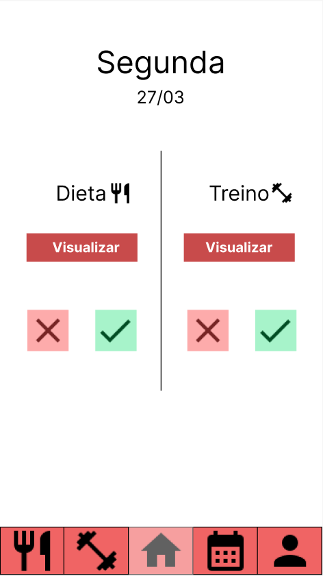

# Template Padrão da Aplicação

O template padrão da aplicação é composto por um menu inferior, onde a navegação é feita ao clicar nos ícones de Dieta, Usuário, Treino, Calendário ou Home.

Durante essa navegação, mudará o conteúdo da tela de acordo com o que for selecionado na barra de navegação.

