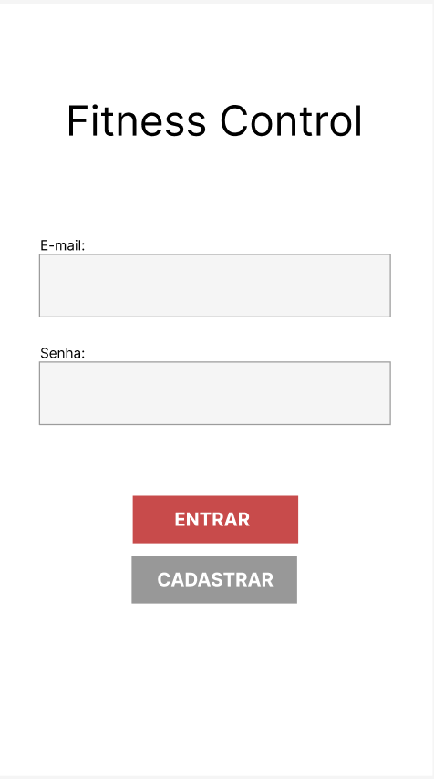
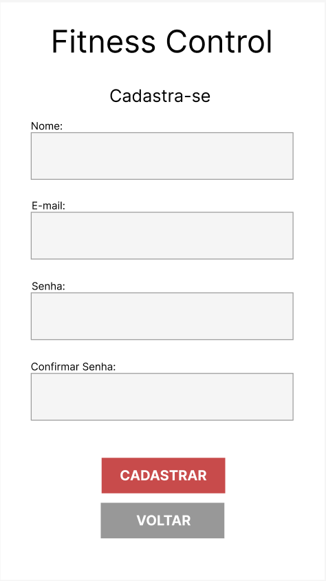
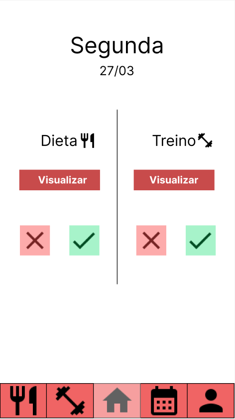
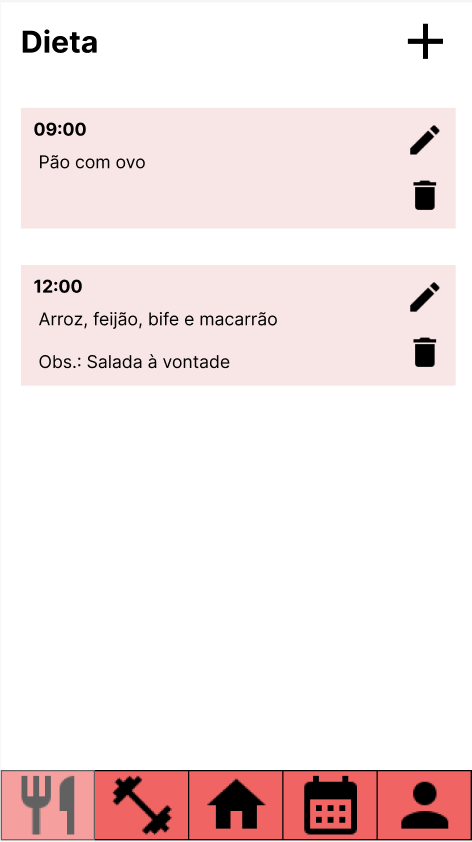
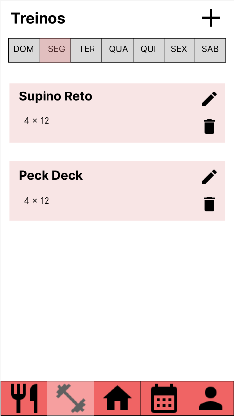
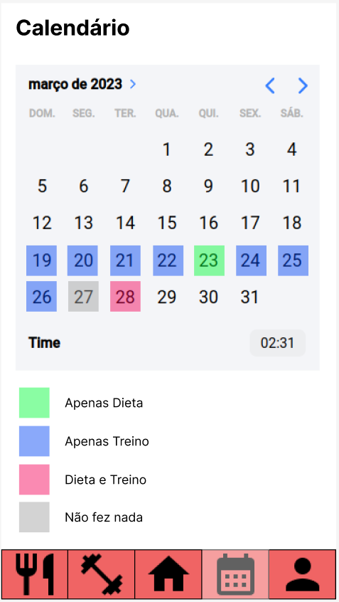
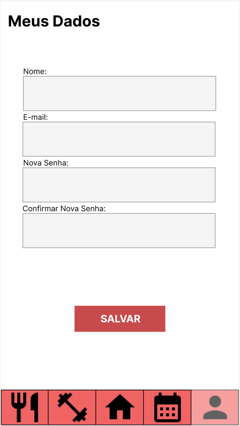

# Programação de Funcionalidades

Nesta seção serão apresentadas as telas desenvolvidas para cada uma das funcionalidades do sistema, especificadas durante os Requisitos Funcionais.

## Tela de Login

### Requisitos Atendidos

* RF-002 | A aplicação deverá possuir um formulário de login para autenticação e acesso dos usuários

### Artefatos de Funcionalidade
* Login.js

## Tela de Cadastro

### Requisitos Atendidos

* RF-001 | A aplicação deverá possuir um formulário de cadastro para novos usuários

### Artefatos de Funcionalidade
* Cadastro.js

## Home

### Requisitos Atendidos

* RF-003 |  A home deverá possuir um painel com horário e dia da semana em que a aplicação está sendo acessada
* RF-004 |  A home deverá possuir um botão escrito "Dieta" onde o usuário poderá marcar se ele concluiu ou não a dieta naquele dia
* RF-005 | A home deverá possuir um botão escrito "Treino" onde o usuário poderá marcar se ele concluiu ou não o treino do dia
* RF-006 | O botão de "Dieta" ao ser acionado deverá redirecionar o usuário para a página da dieta do dia
* RF-007 | O botão de "Treino" ao ser acionado deverá redirecionar o usuário para a página de treino do dia
* RF-008 | O display padrão do menu do aplicativo deverá ser no rodapé da aplicação contendo os campos "Treino", "Dieta", "Calendário" e "Usuário

### Artefatos de Funcionalidade
* Home.js

## Tela de Dieta

### Requisitos Atendidos
* RF-011 | A tela de Dieta deverá conter o plano alimentar geral para que o usuário possa acompanhar sua dieta
* RF-012 | Deverá ser possível cadastrar os macronutrientes como calorias do dia, quantidade de proteínas, carboidratos, quantidade de cada alimento

### Artefatos de Funcionalidade
* Dieta.js

## Tela de Treinos

### Requisitos Atendidos

* RF-009 | A tela de treino deverá conter a programação dos treinos nos dias da semana
* RF-010 | A ficha de treino poderá ser editada alterando os exercícios e número de séries e repetições

### Artefatos de Funcionalidade
* Treinos.js

## Tela de Calendário

### Requisitos Atendidos

* RF-013 | A tela de Calendário irá concentrar um calendário que se atualizará automaticamente de acordo com a conclusão ou não do treino e dieta marcada na home, de forma que o usuário consiga acompanhar quantos dias cumpriu o planejamento ou não

### Artefatos de Funcionalidade
* Calendario.js

## Tela de Usuário

### Requisitos Atendidos

* RF-014 | A tela de usuário deverá conter a opção de edição de perfil e sair da plataforma.

### Artefatos de Funcionalidade
* Usuario.js
