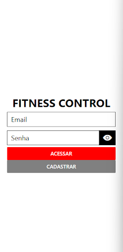
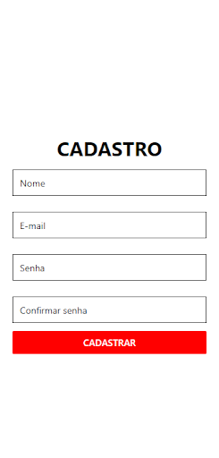

# Programação de Funcionalidades

Nesta seção serão apresentadas as telas desenvolvidas para cada uma das funcionalidades do sistema, especificadas durante os Requisitos Funcionais.

## Tela de Login (RF-02)

### Requisitos atendidos:
A aplicação deverá possuir um formulário de login para autenticação e acesso dos usuários

### Artefatos da Funcionalidade:
FormularioLogin.js

## Tela de Cadastro (RF-01)

### Requisitos atendidos:
A aplicação deverá possuir um formulário de cadastro para novos usuários

### Artefatos da Funcionalidade:
FormularioCadastro.js

