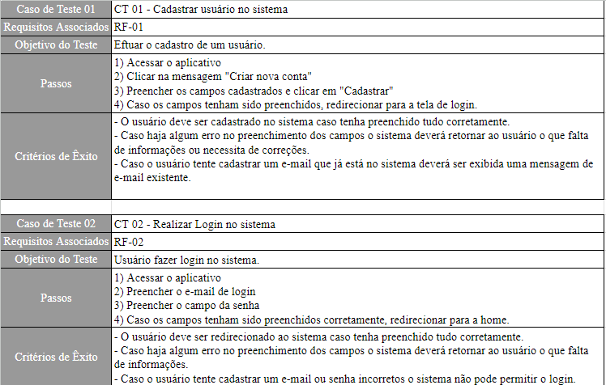
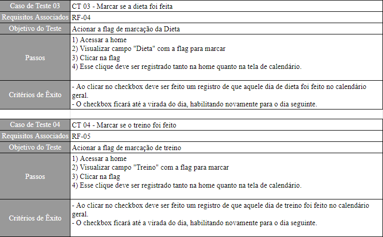
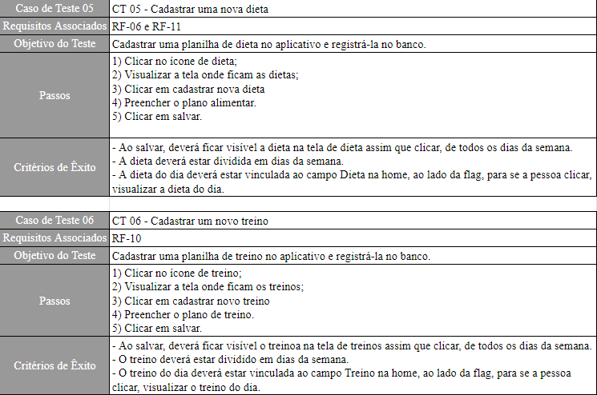
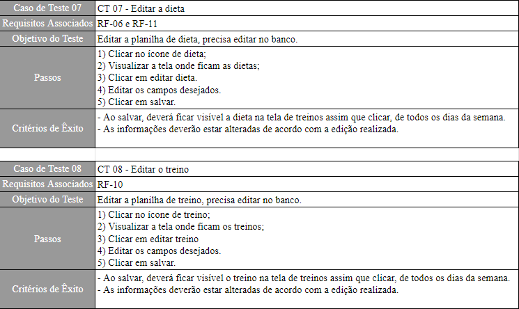
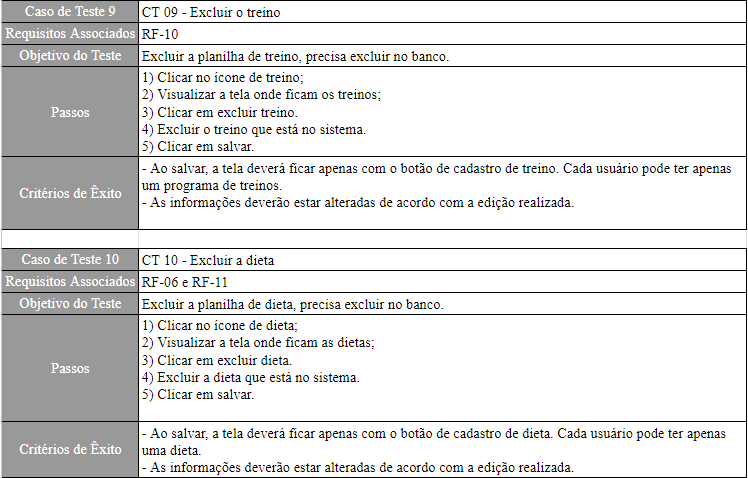
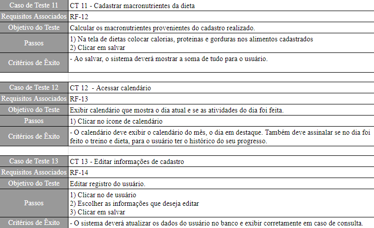

# Plano de Testes de Software

O plano de testes será responsável por orientar o teste das funcionalidades propostas nos requisitos funcionais. Assim, será possível garantir um desenvolvimento mais seguro e orientado a testes, melhorando a qualidade do que será entregue.

