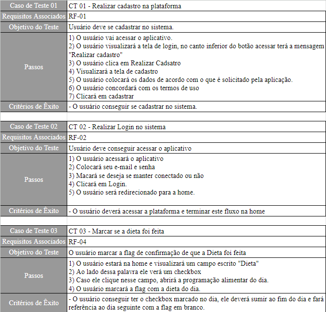
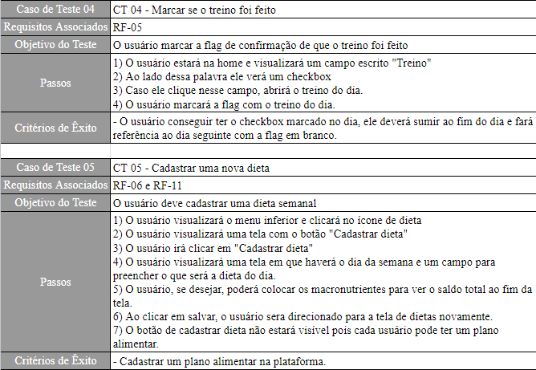
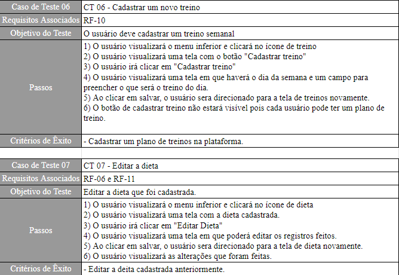
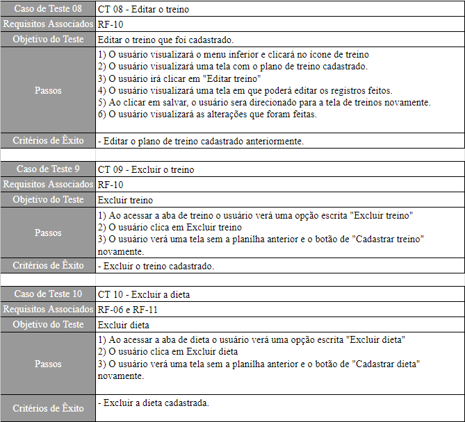
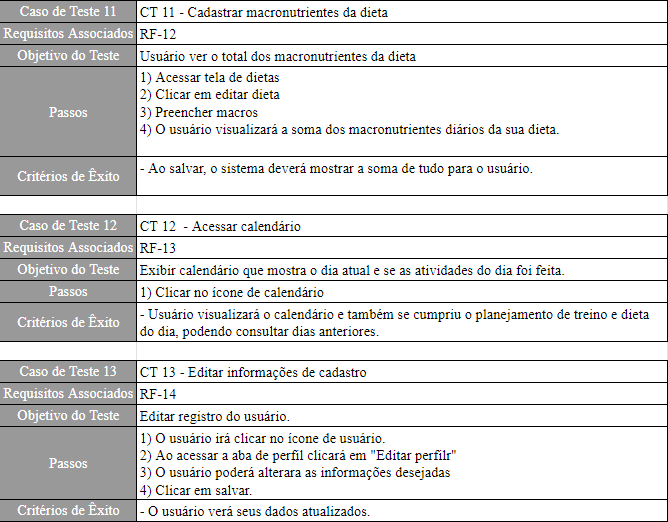

# Plano de Testes de Usabilidade

O teste de usabilidade irá auxiliar na avaliação da interface com o usuário no desenvolvimento da aplicação. Ele é gerado de acordo com as especificações do projeto. Esse tipo de teste é realizado por pessoas externas ao projeto e é supervisionado por membros da equipe a fim de encontrar algum problema ou falha no sistema. Nesse tipo de teste a dificuldade de uso e como o usuário utiliza o sistema são pontos extremamente relevantes na construção da aplicação.

